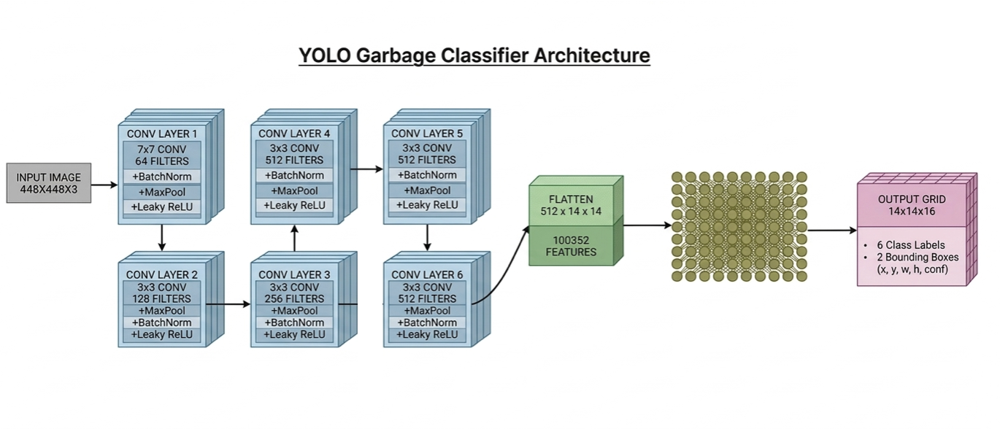
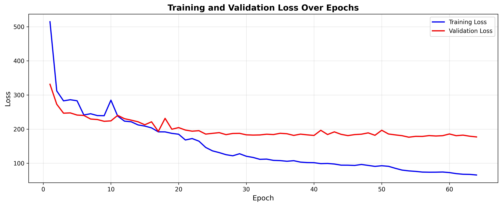

# SortNow: AI-Powered Waste Classification System

A Custom YOLO based waste detection system for real-time waste classification through web interface. Classifying waste into 6 categories: Biodegradable, Cardboard, Glass, Metal, Paper, and Plastic. 

### Key Features
- Custom YOLO with 14×14 grid detection, 2 boxes per cell, 6 classes
- Flask web application with interactive UI
- Trained on 7,260 images, validated on 3,114 images

## Model Architecture



- **Type**: Custom YOLOv1
- **Input Size**: 448×448 pixels
- **Grid Size**: 14×14 (S=14)
- **Bounding Boxes per Cell**: 2 (B=2)
- **Classes**: 6 waste categories
- **Output**: Class predictions + bounding box coordinates

## Dataset

**Original:** [Roboflow Garbage Classification](https://universe.roboflow.com/material-identification/garbage-classification-3)  
**Preprocessed:** [Custom Kaggle Dataset](https://www.kaggle.com/datasets/lavanyanigam/garbageclassificationfinal)

### Preprocessing
1. Analyzed dataset with `preprocessing/analyze.py`
2. Filtered images with >98 objects using `preprocessing/max_obj_filter.py`
4. Final: 7,260 images across 6 classes


## Reproduce Training

- **Fork notebook:** [Kaggle Notebook Link](https://www.kaggle.com/code/lavanyanigam/yolo-from-scratch)
- **Use dataset:** [Custom Kaggle Dataset](https://www.kaggle.com/datasets/lavanyanigam/garbageclassificationfinal)
- Train on Kaggle GPU
- Download `best_model.pth`
- **Live Demo on Hugging Face Spaces:** https://huggingface.co/spaces/lavanyanigam/SortNow

## Installation for Web Interface

1. **Clone the Repository**
```bash
git clone https://github.com/lavanyanigam/SortNow.git
cd SortNow
```

2. **Install Dependencies**
```bash
pip install -r requirements.txt
```

3. **Download Trained Model:** 

* **Google Drive**: [Download best_model.pth](https://drive.google.com/drive/folders/1ivYL-NOWnobMNxCAc_xLHM5FVsEsOz0q?usp=sharing)

* Place it in the project root so that your folder looks like

```text
SortNow/
├── app.py
├── best_model.pth
├── requirements.txt
├── templates/
└── static/
```

## Usage

1. **Run the Application**
```bash
python app.py
```
2. **Open in Browser**
```
http://localhost:5001
```
3. **Classify Waste**

## Training Details

- **Notebook:** [Training Code](https://www.kaggle.com/code/lavanyanigam/yolo-from-scratch)
- **Framework:** PyTorch
- **Optimizer:** Adam 
- **Learning rate:** 1e-4 
- **Batch size:** 16
- **Epochs:** 100 (Early stopping at Epoch 64)
- **Hardware:** Kaggle GPU P100

## Results

- Early stopping triggered at epoch 64
- Best model at epoch 54 with validation loss: 176.3113
- Final training loss: 65.5796
- Final validation loss: 177.0820
- These results indicate **overfitting**, likely due to dataset imbalance and limited model capacity. 
- 

## **Development History**

- Phase 1 - training on YOLOv11 pre-trained `development_iterations/sortnow_yolov11s_training.ipynb`
- Phase 2 - Single Object Detection `development_iterations/single-obj-detection.ipynb`
- Phase 3 - Custom Multi-Object Detection model (https://www.kaggle.com/code/lavanyanigam/yolo-from-scratch)
