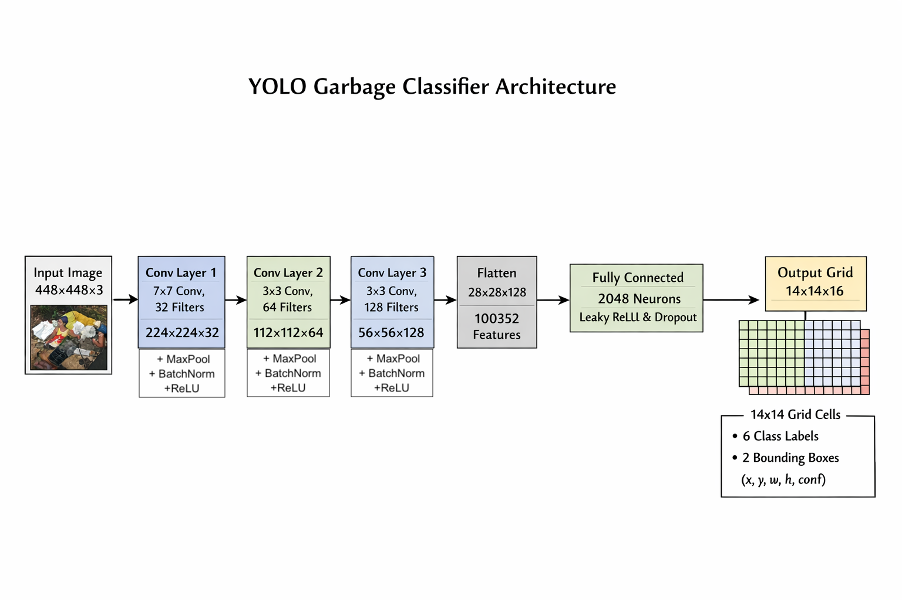

# Model Weights

## Download Trained Model

**Google Drive**: [Download best_model.pth](https://drive.google.com/drive/folders/1ivYL-NOWnobMNxCAc_xLHM5FVsEsOz0q?usp=sharing)

**File Details**:
- **Filename**: `best_model.pth`
- **Size**: ~2.44 GB
- **Format**: PyTorch checkpoint (.pth)
- **Training Platform**: Kaggle P100 GPU
- **Best Epoch**: 54/100
- **Training Loss**: 65.5796
- **Validation Loss**: 177.0820


## Model Information

### Architecture
- **Type**: Custom YOLOv1
- **Input Size**: 448×448 pixels
- **Grid Size**: 14×14 (S=14)
- **Bounding Boxes per Cell**: 2 (B=2)
- **Classes**: 6 waste categories
- **Output**: Class predictions + bounding box coordinates
- 


### Classes
```python
CLASS_NAMES = {
    0: 'BIODEGRADABLE',
    1: 'CARDBOARD',
    2: 'GLASS',
    3: 'METAL',
    4: 'PAPER',
    5: 'PLASTIC'
}
